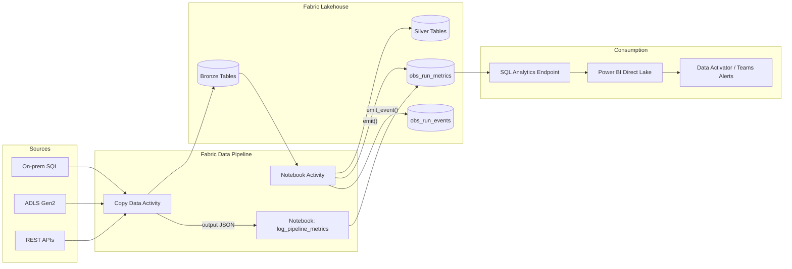

# Custom Observability for Microsoft Fabric Notebooks and Copy Data Activities

This Blog is still a Work In Progress

## Problem Context

Microsoft Fabric ships with a useful set of out-of-the-box monitoring surfaces — the **Monitoring Hub**, pipeline run history, Spark application UI, and the **Capacity Metrics App**. They answer questions like *"did my pipeline succeed?"*, *"how many CUs did it burn?"*, and *"how long did the Spark job run?"*.

What they do *not* answer well are the questions data engineering teams actually get paged on:

- How many rows did notebook `bronze_to_silver_customers` write *per source table* in the last 24 hours?
- Which of my 200 Copy Data Activities is silently degrading — taking 30% longer week-over-week?
- What was the **business-level reject rate** (failed schema validation, late-arriving keys, null business keys) on yesterday's load?
- For a specific `batch_id`, can I show end-to-end lineage — every notebook cell and every Copy Activity — on a single timeline?

The Monitoring Hub is per-item and ephemeral. The Capacity Metrics App is aggregated at the artifact level. Neither gives you a queryable, long-retention, **business-aware** observability store.

This post walks through a lightweight pattern we have used on multiple Fabric implementations: a **custom observability Delta table inside the Lakehouse**, populated from both **Fabric Notebooks** (PySpark) and **Fabric Data Pipeline Copy Activities**, and surfaced through a Direct Lake Power BI report.

## High Level Architecture



The pattern has three pieces:

1. **`obs_run_metrics`** — a wide Delta table in the Lakehouse holding one row per "logical step" (a notebook run, a Copy Activity, a cell, a stage).
2. **A reusable PySpark helper** (`FabricObservability`) imported by every notebook to emit metrics with a single line of code.
3. **A "logger" notebook** invoked by the pipeline immediately after each Copy Data Activity, fed the activity's `output` JSON, that normalizes and writes the same schema.

> **A note on schemas in Fabric.** Unlike open-source Spark, Fabric Spark does **not** let you run `CREATE SCHEMA obs` against the default catalog — you will hit `Feature not supported on Apache Spark in Microsoft Fabric` from `TridentCoreProxy.failCreateDbIfTrident`. In a Fabric Lakehouse you have two options:
>
> - **Classic Lakehouse** (no nested schemas): use a flat table name like `obs_run_metrics` and reference it as `<LakehouseName>.obs_run_metrics`.
> - **Schema-enabled Lakehouse** (preview): schemas are scoped to the lakehouse, so you must use a three-part name — `CREATE SCHEMA IF NOT EXISTS ObservabilityLakehouse.obs` and then `ObservabilityLakehouse.obs.run_metrics`.
>
> The code below uses the classic-lakehouse name `obs_run_metrics` so it works everywhere; swap in the three-part name if your lakehouse is schema-enabled.

## The Observability Schema

Keep the schema flat and additive. New KPIs go into a `metrics` map so we never have to ALTER TABLE in production.

```python
from pyspark.sql.types import (
    StructType, StructField, StringType, TimestampType,
    LongType, DoubleType, MapType
)

obs_schema = StructType([
    StructField("run_id",          StringType(),  False),  # pipeline run id or notebook run id
    StructField("batch_id",        StringType(),  True),   # business batch / load date key
    StructField("workspace",       StringType(),  False),
    StructField("item_type",       StringType(),  False),  # 'Notebook' | 'CopyActivity' | 'Pipeline'
    StructField("item_name",       StringType(),  False),
    StructField("step_name",       StringType(),  True),   # cell name, table name, etc.
    StructField("source",          StringType(),  True),
    StructField("sink",            StringType(),  True),
    StructField("status",          StringType(),  False),  # Succeeded | Failed | Warning
    StructField("start_time_utc",  TimestampType(), False),
    StructField("end_time_utc",    TimestampType(), False),
    StructField("duration_sec",    DoubleType(),  False),
    StructField("rows_read",       LongType(),    True),
    StructField("rows_written",    LongType(),    True),
    StructField("rows_rejected",   LongType(),    True),
    StructField("bytes_read",      LongType(),    True),
    StructField("bytes_written",   LongType(),    True),
    StructField("error_code",      StringType(),  True),
    StructField("error_message",   StringType(),  True),
    StructField("metrics",         MapType(StringType(), StringType()), True),  # free-form KPIs
    StructField("inserted_at_utc", TimestampType(), False),
])
```

Create the table once. Pick the variant that matches your lakehouse:

```python
# --- Classic Lakehouse (works today, everywhere) -------------------------
TABLE = "obs_run_metrics"

(spark.createDataFrame([], obs_schema)
      .write.format("delta")
      .partitionBy("item_type")
      .mode("ignore")
      .saveAsTable(TABLE))

# --- Schema-enabled Lakehouse (preview) ----------------------------------
# LAKEHOUSE = "ObservabilityLakehouse"
# spark.sql(f"CREATE SCHEMA IF NOT EXISTS {LAKEHOUSE}.obs")
# TABLE = f"{LAKEHOUSE}.obs.run_metrics"
# (spark.createDataFrame([], obs_schema)
#       .write.format("delta")
#       .partitionBy("item_type")
#       .mode("ignore")
#       .saveAsTable(TABLE))
```

If you try the open-source idiom `CREATE SCHEMA IF NOT EXISTS obs` against the default catalog, Fabric will reject it with:

```
Py4JJavaError: An error occurred while calling o407.sql.
java.lang.RuntimeException: Feature not supported on Apache Spark in Microsoft Fabric.
  at com.microsoft.azure.trident.core.TridentHelper.failIfValidTridentContext(...)
  at com.microsoft.azure.trident.spark.TridentCoreProxy.failCreateDbIfTrident(...)
```

That is by design — the lakehouse *is* the database. Either flatten the name or scope the schema to the lakehouse as shown above.

> **Tip:** Partition on `item_type` (low cardinality, 3–5 values) and Z-ORDER by `batch_id, item_name` weekly. Direct Lake reads will stay snappy even at hundreds of millions of rows.
>
> **Tip:** Make the observability Lakehouse the **default** lakehouse of the notebook (pin it in the explorer), so unqualified table names like `obs_run_metrics` resolve without three-part qualification.

## Part 1 — Instrumenting Fabric Notebooks

Drop a single helper notebook into your workspace (we name it `_obs_helper`) and `%run` it from every notebook in your medallion. It exposes a context manager so instrumentation is **one line per logical step**.

```python
# _obs_helper notebook
import uuid, json, time, traceback
from datetime import datetime, timezone
from contextlib import contextmanager
from pyspark.sql import Row
import notebookutils  # Fabric runtime

class FabricObservability:
    # Use "obs_run_metrics" on a classic lakehouse,
    # or "<LakehouseName>.obs.run_metrics" on a schema-enabled lakehouse.
    TABLE = "obs_run_metrics"

    def __init__(self, item_name: str, batch_id: str | None = None):
        ctx = notebookutils.runtime.context  # workspace, notebook, activity ids
        self.workspace  = ctx.get("currentWorkspaceName")
        self.item_name  = item_name
        self.run_id     = ctx.get("activityId") or str(uuid.uuid4())
        self.batch_id   = batch_id or datetime.utcnow().strftime("%Y%m%d")

    @contextmanager
    def step(self, step_name: str, source: str = None, sink: str = None):
        start = datetime.now(timezone.utc)
        payload = {"rows_read": None, "rows_written": None,
                   "rows_rejected": None, "metrics": {}}
        status, err_code, err_msg = "Succeeded", None, None
        try:
            yield payload
        except Exception as e:
            status   = "Failed"
            err_code = type(e).__name__
            err_msg  = str(e)[:4000]
            raise
        finally:
            end = datetime.now(timezone.utc)
            row = Row(
                run_id          = self.run_id,
                batch_id        = self.batch_id,
                workspace       = self.workspace,
                item_type       = "Notebook",
                item_name       = self.item_name,
                step_name       = step_name,
                source          = source,
                sink            = sink,
                status          = status,
                start_time_utc  = start,
                end_time_utc    = end,
                duration_sec    = (end - start).total_seconds(),
                rows_read       = payload.get("rows_read"),
                rows_written    = payload.get("rows_written"),
                rows_rejected   = payload.get("rows_rejected"),
                bytes_read      = None,
                bytes_written   = None,
                error_code      = err_code,
                error_message   = err_msg,
                metrics         = {k: str(v) for k, v in payload["metrics"].items()},
                inserted_at_utc = datetime.now(timezone.utc),
            )
            (spark.createDataFrame([row])
                  .write.format("delta").mode("append")
                  .saveAsTable(self.TABLE))
```

Usage from a real bronze-to-silver notebook is then trivial:

```python
%run /_obs_helper

obs = FabricObservability(item_name="bronze_to_silver_customers",
                          batch_id=pipeline_batch_id)  # passed in as a parameter

with obs.step("read_bronze", source="bronze.customers") as m:
    df = spark.read.table("bronze.customers")
    m["rows_read"] = df.count()

with obs.step("validate", sink="silver.customers") as m:
    bad   = df.filter("business_key IS NULL")
    good  = df.subtract(bad)
    m["rows_rejected"] = bad.count()
    m["rows_written"]  = good.count()
    m["metrics"]["reject_pct"] = round(m["rows_rejected"] / m["rows_read"] * 100, 2)

with obs.step("merge_silver", sink="silver.customers") as m:
    good.createOrReplaceTempView("stg")
    spark.sql("""
        MERGE INTO silver.customers t
        USING stg s ON t.business_key = s.business_key
        WHEN MATCHED THEN UPDATE SET *
        WHEN NOT MATCHED THEN INSERT *
    """)
    # MERGE metrics from Delta history
    hist = spark.sql("DESCRIBE HISTORY silver.customers LIMIT 1").collect()[0]
    op = hist["operationMetrics"]
    m["rows_written"] = int(op.get("numTargetRowsInserted", 0)) + \
                        int(op.get("numTargetRowsUpdated",  0))
    m["metrics"]["num_target_rows_updated"]  = op.get("numTargetRowsUpdated")
    m["metrics"]["num_target_rows_inserted"] = op.get("numTargetRowsInserted")
```

What you get for free:

- Every `step` is one row in `obs.run_metrics`, with start/end, status, and per-step KPIs.
- Exceptions are captured (error class + message), then **re-raised** — so pipeline failure semantics are unchanged.
- Delta's own `operationMetrics` (from `DESCRIBE HISTORY`) are folded into the same store, so your MERGE/UPDATE/DELETE counts are first-class citizens.

## Part 2 — Instrumenting Copy Data Activities

A Fabric Copy Data Activity produces a rich `output` JSON containing `rowsRead`, `rowsCopied`, `dataRead`, `dataWritten`, `copyDuration`, `throughput`, plus errors. We want those rows in the **same** table.

The cleanest pattern is:

1. Add a small notebook `_obs_log_copy` to the workspace.
2. After **every** Copy Data Activity in your pipeline, chain a **Notebook activity** (on both `Succeeded` and `Failed`) that calls `_obs_log_copy` with the upstream activity's output as a parameter.

### The pipeline wiring

In the downstream notebook activity, set base parameters using pipeline expressions:

| Parameter         | Value                                                            |
| ----------------- | ---------------------------------------------------------------- |
| `run_id`          | `@pipeline().RunId`                                              |
| `batch_id`        | `@pipeline().parameters.batch_id`                                |
| `pipeline_name`   | `@pipeline().Pipeline`                                           |
| `activity_name`   | `Copy_Customers` *(name of the upstream copy activity)*          |
| `activity_output` | `@string(activity('Copy_Customers').output)`                     |
| `activity_error`  | `@string(activity('Copy_Customers').error)`                      |
| `status`          | `@activity('Copy_Customers').Status`                             |
| `source_name`     | `@pipeline().parameters.src_table`                               |
| `sink_name`       | `@pipeline().parameters.sink_table`                              |

> Use a **completion** dependency (not just success) on the logger activity so failed copies are still recorded.

### The logger notebook

```python
# _obs_log_copy
import json
from datetime import datetime, timezone
from pyspark.sql import Row

# Parameters cell (Fabric injects values from the pipeline)
run_id          = ""
batch_id        = ""
pipeline_name   = ""
activity_name   = ""
activity_output = "{}"
activity_error  = "{}"
status          = "Succeeded"
source_name     = None
sink_name       = None

out = json.loads(activity_output or "{}")
err = json.loads(activity_error  or "{}")

def _parse_dt(s):
    return datetime.fromisoformat(s.replace("Z", "+00:00")) if s else datetime.now(timezone.utc)

start = _parse_dt(out.get("executionDetails", [{}])[0].get("start"))
duration = float(out.get("copyDuration", 0) or 0)
end   = _parse_dt(out.get("executionDetails", [{}])[0].get("start")) \
        if duration == 0 else datetime.fromtimestamp(start.timestamp() + duration, tz=timezone.utc)

row = Row(
    run_id          = run_id,
    batch_id        = batch_id,
    workspace       = notebookutils.runtime.context.get("currentWorkspaceName"),
    item_type       = "CopyActivity",
    item_name       = f"{pipeline_name}.{activity_name}",
    step_name       = activity_name,
    source          = source_name,
    sink            = sink_name,
    status          = status,
    start_time_utc  = start,
    end_time_utc    = end,
    duration_sec    = duration,
    rows_read       = int(out.get("rowsRead",   0) or 0),
    rows_written    = int(out.get("rowsCopied", 0) or 0),
    rows_rejected   = int(out.get("rowsSkipped", 0) or 0),
    bytes_read      = int(out.get("dataRead",    0) or 0),
    bytes_written   = int(out.get("dataWritten", 0) or 0),
    error_code      = err.get("errorCode"),
    error_message   = (err.get("message") or "")[:4000] or None,
    metrics         = {
        "throughput_mb_s":   str(out.get("throughput")),
        "used_parallel_copies": str(out.get("usedParallelCopies")),
        "used_data_integration_units": str(out.get("usedDataIntegrationUnits")),
    },
    inserted_at_utc = datetime.now(timezone.utc),
)

(spark.createDataFrame([row])
      .write.format("delta").mode("append")
      .saveAsTable("obs_run_metrics"))
```

Now every copy — regardless of source/sink — lands in the same Delta table with the same shape as your notebook metrics.

> **Scaling tip:** If you have dozens of copy activities per pipeline and don't want to chain a logger after each one, wrap the Copy + Logger pair in a child pipeline and `Invoke Pipeline` it from the parent. You write the plumbing once.

## Part 3 — Querying and Alerting

Because `obs_run_metrics` is a regular Delta table in the Lakehouse, **the SQL Analytics Endpoint exposes it instantly** and Power BI can consume it in **Direct Lake** mode — no refresh schedule, no import.

A few queries we use day one:

**Top 10 slowest steps over the last 7 days, with week-over-week drift:**

```sql
WITH last7 AS (
  SELECT item_name, step_name, AVG(duration_sec) AS avg_now
  FROM obs_run_metrics
  WHERE start_time_utc >= current_timestamp() - INTERVAL 7 DAYS
    AND status = 'Succeeded'
  GROUP BY item_name, step_name
),
prev7 AS (
  SELECT item_name, step_name, AVG(duration_sec) AS avg_prev
  FROM obs_run_metrics
  WHERE start_time_utc BETWEEN current_timestamp() - INTERVAL 14 DAYS
                           AND current_timestamp() - INTERVAL  7 DAYS
    AND status = 'Succeeded'
  GROUP BY item_name, step_name
)
SELECT l.item_name, l.step_name,
       l.avg_now, p.avg_prev,
       round((l.avg_now - p.avg_prev) / p.avg_prev * 100, 1) AS pct_change
FROM last7 l JOIN prev7 p USING (item_name, step_name)
ORDER BY pct_change DESC
LIMIT 10;
```

**Reject-rate SLO breach per batch:**

```sql
SELECT batch_id, item_name,
       SUM(rows_rejected) AS rejected,
       SUM(rows_read)     AS read,
       round(SUM(rows_rejected) * 100.0 / SUM(rows_read), 2) AS reject_pct
FROM obs_run_metrics
WHERE start_time_utc >= current_date() - INTERVAL 1 DAYS
GROUP BY batch_id, item_name
HAVING reject_pct > 1.0
ORDER BY reject_pct DESC;
```

Wire either query into a **Data Activator** reflex on top of the Power BI semantic model and you have alerting in Teams within minutes — no Log Analytics workspace, no separate observability stack.

## Operational Considerations

- **Cost.** A row is ~1 KB. A workspace running 500 pipeline runs/day with ~10 steps each adds ~150 MB/year — negligible on any Fabric capacity. Run `OPTIMIZE obs_run_metrics ZORDER BY (batch_id, item_name)` weekly via a scheduled notebook.
- **Retention.** `DELETE FROM obs_run_metrics WHERE inserted_at_utc < current_date() - INTERVAL 365 DAYS` followed by `VACUUM obs_run_metrics RETAIN 168 HOURS` keeps the footprint bounded.
- **Concurrency.** Appends from many notebooks/activities concurrently are safe (Delta optimistic concurrency on append-only writes), but avoid simultaneous `OPTIMIZE` and heavy writes; schedule maintenance off-peak.
- **PII.** Treat `error_message` as potentially sensitive — Copy Activity errors can echo source connection strings. Truncate (we cap at 4000 chars) and consider a `sha2()` of payload samples instead of the payload itself.
- **Don't reinvent capacity metrics.** This pattern complements — not replaces — the Fabric Capacity Metrics App. Keep using that for CU consumption; use `obs.run_metrics` for *what* the workload did, not *how much it cost the capacity*.

## Wrap-up

Fabric's native monitoring is good enough to know **that** a workload ran. A 50-line PySpark helper plus one logger notebook is enough to know **what it actually did** — per source, per sink, per batch — in a queryable Delta table that Power BI and Data Activator can light up immediately.

The one Fabric-specific gotcha to remember: **don't try to `CREATE SCHEMA` against the default catalog** — either flatten table names (classic lakehouse) or use a three-part `<lakehouse>.<schema>.<table>` name (schema-enabled lakehouse).

The pattern is intentionally boring: one Delta table, one schema, two writers (notebook helper + copy-activity logger). That boringness is the point — it scales from one pipeline to several hundred without any architectural change.
