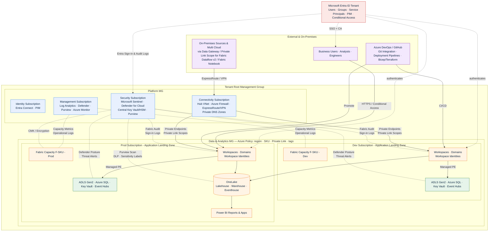
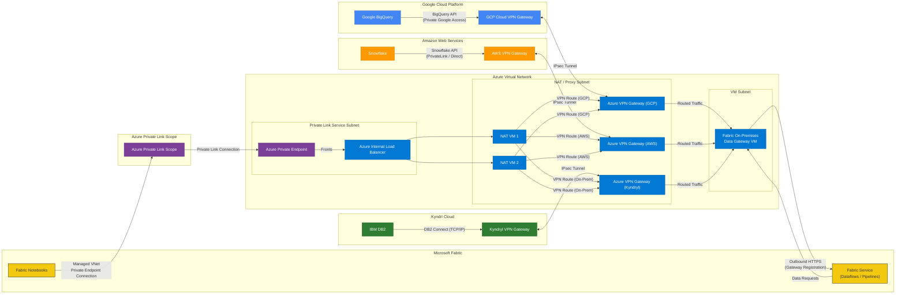

# Designing an Azure Enterprise-Scale Landing Zone for Microsoft Fabric Workloads

*A practical blueprint for bringing Fabric into a governed, enterprise-ready Azure environment.*

---

## Why Fabric needs a landing zone

Microsoft Fabric is delivered as a **SaaS analytics platform** built on top of Azure, unifying Data Factory, Data Engineering, Data Warehouse, Real-Time Intelligence, Data Science, and Power BI on a shared **OneLake** foundation. Because it is SaaS, it's tempting to treat Fabric as "outside" your Azure landing zone — but in reality, every Fabric capacity is a **first-class Azure resource** that consumes identity from Microsoft Entra, bills through your Azure subscription, and connects to the rest of your data estate through Azure networking.

That makes Fabric a natural fit for the [Azure landing zone](https://learn.microsoft.com/azure/cloud-adoption-framework/ready/landing-zone/) (ALZ) approach defined in the Cloud Adoption Framework: a modular, opinionated architecture that applies consistent controls for identity, networking, security, governance, and operations across every subscription.

---

## The reference shape

In an enterprise-scale design, Fabric typically sits inside a **data platform application landing zone** (a spoke), governed by the central **platform landing zone** (hub):

| Layer | Responsibility | Fabric mapping |
|---|---|---|
| Platform – Identity | Microsoft Entra ID tenant, groups, PIM, Conditional Access | Fabric tenant is bound to the same Entra tenant; users, service principals, and **workspace identities** are issued here |
| Platform – Connectivity | Hub VNet, ExpressRoute/VPN, Private DNS, Firewall | Hosts Private Endpoints for OneLake, Warehouse SQL, and on-prem data gateway egress |
| Platform – Security | Microsoft Defender for Cloud, Microsoft Sentinel, Key Vault, Purview, Azure Policy guardrails | Ingests Fabric audit and activity logs into Sentinel; Purview governs OneLake and mirrored sources; AKV stores connection secrets; policies enforce private-link, allowed SKUs, and tag standards |
| Platform – Management | Log Analytics, Defender for Cloud, Policy | Receives Fabric capacity metrics, Purview audit logs, and DLP alerts |
| Application LZ – Data | Subscription(s) holding Fabric capacities and adjacent Azure data services | F-SKU capacities, Azure Storage (shortcuts), Azure SQL/Synapse mirrored sources, AKV |

Use a dedicated **management group** for data & analytics so that Azure Policy can enforce capacity SKUs, allowed regions, private-link requirements, and tag standards consistently across every Fabric subscription.

---

## Architecture diagram

---

## Eight design areas, applied to Fabric

### 1. Identity and access

- Bind the Fabric tenant to your corporate Entra ID; reuse Conditional Access and MFA.
- Prefer **workspace identities** and service principals for outbound connections to Azure data sources — not user credentials.
- Use Entra security groups (not individual users) for **workspace roles** (Admin, Member, Contributor, Viewer) and capacity assignment.

### 2. Network topology and connectivity

- Enable **Private Link at the tenant or workspace level** and turn on *Block Public Internet Access* for sensitive tenants.
- Use **Managed VNets and Managed Private Endpoints** so that Spark, pipelines, and OneLake reach Azure PaaS sources (ADLS, SQL, Key Vault) without traversing the public internet.
- Place Private DNS zones for `*.fabric.microsoft.com` and `*.onelake.dfs.fabric.microsoft.com` in the hub.
- Use the following patterns to have a robust Data Ingestion pattern that supports Low Code (Fabric Dataflow v2) and Pro Code (Fabric Notebooks)

### 3. Resource organization

- One **management group** for analytics; child subscriptions for *Platform-Shared*, *Dev*, *Test*, and *Prod* Fabric capacities.
- Capacities act as **isolation and chargeback boundaries** — split them by environment and, where needed, by business domain.

### 4. Governance

- Adopt **OneLake Catalog + Microsoft Purview** (built into Fabric) for discovery, sensitivity labels, lineage, and DLP.
- Use Fabric **domains and subdomains** to mirror your business architecture; assign domain owners from the COE.
- Enforce metadata scanning via the **Admin scanner APIs** for tenant-wide cataloging.

### 5. Security

- Apply sensitivity labels at ingestion; let them flow through OneLake to Power BI exports.
- Layer **item-level controls** — RLS/CLS on Warehouse, SQL analytics endpoint, and KQL databases — on top of workspace roles.
- Store secrets in **Azure Key Vault** and reference them through Fabric connections, never inline.

### 6. Management and monitoring

- Stream **Fabric capacity metrics**, Purview audit logs, and Entra sign-in logs into a central **Log Analytics workspace** in the management subscription.
- Use the **Capacity Metrics app** plus Azure Monitor workbooks for throttling, smoothing, and chargeback insight.

### 7. Business continuity and DR

- Choose capacity **home regions** aligned with data residency; enable **OneLake disaster recovery** and cross-region replication for critical lakehouses.
- Externalize CI/CD artifacts in **Git (Azure DevOps or GitHub)** using Fabric's built-in Git integration so workspaces are reproducible.

### 8. Platform automation and DevOps

- Provision capacities, workspace identities, role assignments, and Private Endpoints with **Bicep / Terraform** as part of subscription vending.
- Promote Fabric items across DTAP through **deployment pipelines** or Git-based CI/CD; keep dev workspaces isolated per developer.

---

## A typical landing pattern

1. **Platform team** vends a *Data Analytics* subscription with policy-enforced tagging, region, and Private Link requirements.
2. **Data platform team** deploys an **F-SKU Fabric capacity**, attaches it to a domain, and creates Dev/Test/Prod **workspaces** bound to Entra groups.
3. **Workspace identity** is provisioned and granted least-privilege RBAC on the Azure data sources it must read (ADLS Gen2, Azure SQL, Event Hubs).
4. **Managed Private Endpoints** are approved for each source; on-prem systems reach Fabric through the **on-premises data gateway** or mirroring.
5. **Purview** scans the tenant; sensitivity labels and DLP policies activate automatically across new items.
6. **Monitoring** lights up: capacity metrics, audit logs, and Defender alerts flow to the central Log Analytics workspace.

---

## Anti-patterns to avoid

- ❌ One giant shared capacity for every team — you lose isolation and chargeback signal.
- ❌ Per-user workspace permissions — unmanageable at scale; always use Entra groups.
- ❌ Public endpoints on production tenants — enable Private Link and block public access.
- ❌ Treating Fabric as "outside" governance — it belongs inside your ALZ policy and Purview scope.
- ❌ Manual workspace creation — automate via subscription vending and Git-backed deployment pipelines.

---

## Closing thought

Microsoft Fabric removes most of the infrastructure plumbing, but it does **not** remove the need for an enterprise-scale operating model. By landing Fabric inside an Azure landing zone — with Entra-driven identity, Private Link networking, Purview governance, capacity-based isolation, and IaC-driven vending — you give your analytics teams a paved road that is secure, compliant, and ready to scale from a single lakehouse to a tenant-wide data mesh.

### References
- [What is an Azure landing zone?](https://learn.microsoft.com/azure/cloud-adoption-framework/ready/landing-zone/)
- [What is Microsoft Fabric?](https://learn.microsoft.com/fabric/fundamentals/microsoft-fabric-overview)
- [Integrate Microsoft Fabric with external systems and platform connectivity](https://learn.microsoft.com/fabric/fundamentals/external-integration)
- [Fabric governance overview and guidance](https://learn.microsoft.com/fabric/governance/governance-compliance-overview)
- [Workspace identity in Microsoft Fabric](https://learn.microsoft.com/fabric/security/workspace-identity)
- [Managed Private Endpoints in Fabric](https://learn.microsoft.com/fabric/security/security-managed-private-endpoints-overview)
- [Enterprise BI with Microsoft Fabric (reference architecture)](https://learn.microsoft.com/azure/architecture/example-scenario/analytics/enterprise-bi-microsoft-fabric)
